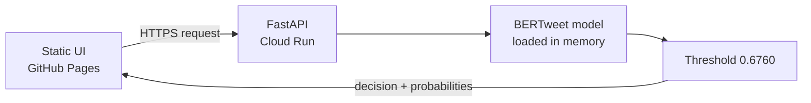

# BERTweet Guard — BERTweet + LoRA Text Moderation

An end-to-end AI model development project for fine-tuning **BERTweet** with **LoRA**, **Weighted Focal Loss**, cosine learning-rate scheduling, and validation-calibrated decision thresholds.

The central focus of this repository is the **machine-learning work**: controlled experimentation, model comparison, large-dataset fine-tuning, evaluation, threshold optimization, and export of a reusable moderation model. The FastAPI service, Docker image, CI/CD pipeline, and Cloud Run deployment complete the project by making the trained model usable outside a notebook.

> **Live application:** [bertweet.anutej.us](http://bertweet.anutej.us/)  
> **Frontend repository:** [bertweet-guard-ui](https://github.com/anutej-kardele/bertweet-guard-ui)  
> **Model repository:** [`anutej9/bertweet-guard`](https://huggingface.co/anutej9/bertweet-guard)

| Project area | Current choice |
| --- | --- |
| Backbone | `vinai/bertweet-base` |
| Fine-tuning method | LoRA |
| Training loss | Weighted Focal Loss |
| Primary selection metric | Macro F1 |
| Production task | Binary moderation: `normal` vs. `flagged` |
| Deployed decision threshold | `0.6760` |
| Inference service | FastAPI on Google Cloud Run |

---

## 1. Project Motivation

Content moderation is not only a deployment problem. The main challenge is finding a model and training configuration that can identify harmful text without incorrectly flagging too much benign discussion.

This project was developed in two research phases:

1. **Experiment broadly on the smaller THOS dataset** to compare model families, fine-tuning strategies, LoRA configurations, loss functions, schedulers, and training choices.
2. **Scale the strongest approach to the much larger Jigsaw Toxic Comment dataset**, then refine preprocessing, class weighting, checkpoint selection, evaluation, and the decision threshold used during inference.

The resulting model is exposed through an API and a separate browser interface, but those deployment components support the primary objective: producing a practical, customizable text-moderation model.

---

## 2. Research Journey

### Phase 1 — THOS experimentation

> **Public repository note:** The THOS work was completed as part of a university project. The original THOS notebook and university-project implementation are not included in this public repository. Only a high-level summary of the experiments, results, and conclusions is documented here.

THOS provided a smaller and faster environment for comparing ideas before committing compute to a much larger dataset.

The THOS task used three classes:

- `normal`
- `offensive`
- `hate`

The goal was not to choose BERTweet in advance. Multiple approaches were tested to identify which decisions consistently improved minority-class performance and overall Macro F1.

Experiments included:

- Zero-shot BERT
- Full BERT fine-tuning
- LoRA fine-tuning
- LoRA rank experiments using `r=8`, `r=16`, and `r=32`
- Focal Loss
- Focal Loss gamma experiments
- BERTweet
- Full BERTweet fine-tuning
- BERTweet + LoRA
- Broader LoRA target modules
- Cosine learning-rate scheduling
- Early stopping
- Longer training
- Attention visualization
- Fairness analysis

### Strongest THOS result

The best-performing THOS configuration was:

**BERTweet + LoRA `r=16` + Focal Loss (`γ=1`) + Cosine Scheduler**

| Metric | Score |
| --- | ---: |
| Test Macro F1 | **0.6848** |
| Best Validation F1 | 0.6741 |
| Normal F1 | 0.8125 |
| Offensive F1 | 0.5895 |
| Hate F1 | 0.6523 |


<details>
<summary><strong>Full THOS experiment comparison</strong></summary>

| Model | Test Macro F1 | Best Val F1 | Normal F1 | Offensive F1 | Hate F1 |
| --- | ---: | ---: | ---: | ---: | ---: |
| **BERTweet LoRA r=16 + Focal(γ=1) + Cosine** | **0.6848** | 0.6741 | 0.8125 | 0.5895 | 0.6523 |
| LoRA r=16 broad | 0.6810 | 0.6282 | 0.7951 | 0.5801 | 0.6680 |
| BERTweet Full | 0.6714 | 0.6565 | 0.7855 | 0.5508 | 0.6781 |
| BERT Extended (Cosine) | 0.6677 | 0.6304 | 0.7740 | 0.5591 | 0.6699 |
| BERTweet LoRA r=16 Q+K+V+Dense + Focal(γ=1) + Cosine | 0.6667 | 0.6665 | 0.7805 | 0.5580 | 0.6615 |
| LoRA r=32 | 0.6563 | 0.6371 | 0.7604 | 0.5588 | 0.6498 |
| LoRA r=16 | 0.6543 | 0.6402 | 0.7990 | 0.5514 | 0.6126 |
| BERT LoRA r=16 Q+K+V+Dense + Focal(γ=1) + Cosine | 0.6488 | 0.6381 | 0.7871 | 0.5509 | 0.6083 |
| Fine-Tuned BERT | 0.6486 | 0.6415 | 0.7990 | 0.5538 | 0.5931 |
| LoRA + Focal Loss | 0.6482 | 0.6234 | 0.7956 | 0.5633 | 0.5856 |
| BERTweet + LoRA | 0.6460 | 0.6408 | 0.7880 | 0.5680 | 0.5819 |
| BERT LoRA r=16 + Focal(γ=1) + Cosine | 0.6433 | 0.6344 | 0.7688 | 0.5422 | 0.6189 |
| LoRA BERT (r=8) | 0.6378 | 0.6296 | 0.8007 | 0.5271 | 0.5855 |
| LoRA + FL (γ=1.0) | 0.6365 | 0.6302 | 0.7966 | 0.5429 | 0.5701 |
| Zero-Shot BERT | 0.0879 | n/a | 0.0708 | 0.1931 | 0.0000 |

</details>

The experiments pointed to a clear modeling direction:

```text
BERTweet
    +
LoRA
    +
Focal Loss
    +
Cosine learning-rate scheduling
```

This combination became the starting point for the larger-data phase. The later Jigsaw work refined the configuration rather than restarting the search from scratch.

---

## 3. Why These Modeling Choices?

### BERTweet

BERTweet is a transformer model pretrained on English tweets. Its pretraining domain makes it a natural candidate for short, informal, user-generated text containing unconventional punctuation, abbreviations, mentions, and other social-media patterns.

### LoRA

Low-Rank Adaptation adds trainable low-rank matrices to selected transformer modules while leaving most pretrained parameters frozen. This makes experimentation more memory-efficient than full-model fine-tuning and allows different adaptation configurations to be compared without training every model parameter.

### Weighted Focal Loss

Moderation data is imbalanced: benign examples are usually more common than harmful examples. Weighted Focal Loss combines class weighting with extra attention to difficult examples, helping the training objective focus less on already-easy majority-class predictions.

### Cosine scheduling with warmup

Warmup reduces instability during the first training steps, while cosine decay gradually lowers the learning rate later in training. This combination performed well during the THOS comparison and was carried into the Jigsaw phase.

### Macro F1

Accuracy can look strong even when a model performs poorly on the less frequent harmful class. Macro F1 assigns equal importance to each class's F1 score, making it a more useful primary metric for this project.

---

## 4. Scaling the Model to Jigsaw

After identifying the strongest direction on THOS, the project moved to the much larger **Jigsaw Toxic Comment Classification** dataset.

The Jigsaw source labels are collapsed into a binary moderation target:

```text
normal  = 0
flagged = 1
```

A comment is marked `flagged` when any of these source labels is positive:

- `toxic`
- `severe_toxic`
- `threat`
- `obscene`
- `insult`
- `identity_hate`

The larger dataset uses a **90 / 5 / 5 stratified train / validation / test split**.

- **Training split:** parameter optimization
- **Validation split:** checkpoint selection and decision-threshold tuning
- **Test split:** final evaluation only

### Current training configuration

| Component | Value |
| --- | --- |
| Backbone | `vinai/bertweet-base` |
| Task | Binary sequence classification |
| Labels | `normal`, `flagged` |
| Maximum sequence length | 128 |
| Batch size | 32 |
| LoRA rank | 32 |
| LoRA alpha | 64 |
| LoRA dropout | 0.20 |
| LoRA targets | `query`, `key`, `value`, `dense` |
| Loss | Weighted Focal Loss |
| Focal gamma | 1.0 |
| Class weights | `[1.0, 1.25]` |
| Learning rate | `5e-5` |
| Weight decay | `0.05` |
| Maximum epochs | 5 |
| Early-stopping patience | 2 |
| Scheduler | Cosine with warmup |
| Warmup ratio | 0.06 |
| Random seed | 42 |
| Primary metric | Macro F1 |

The v4 notebook aligns preprocessing more closely with BERTweet and selects checkpoints using **threshold-tuned validation Macro F1**.

---

## 5. End-to-End Modeling Pipeline

```text
Jigsaw toxicity data
        ↓
Binary normal / flagged labels
        ↓
Minimal BERTweet-aligned preprocessing
        ↓
BERTweet tokenizer
        ↓
BERTweet + LoRA fine-tuning
        ↓
Weighted Focal Loss
        ↓
Cosine learning-rate schedule + warmup
        ↓
Validation probability predictions
        ↓
Threshold optimization using Macro F1
        ↓
Best checkpoint selection
        ↓
Held-out test evaluation
        ↓
Merge LoRA adapters into BERTweet
        ↓
Export model, tokenizer, and threshold
        ↓
Serve the trained artifact through FastAPI
```

The decision threshold is treated as part of the trained deployment artifact, not as an unrelated API setting.

---

## 6. Decision-Threshold Optimization

The service does not simply use the class with the largest logit:

```python
prediction = logits.argmax()
```

Instead, it computes the probability of the `flagged` class and compares it with a threshold selected on validation data:

```python
prediction = int(flagged_probability >= decision_threshold)
```

The currently deployed threshold is:

```text
0.6760
```

Example:

```text
flagged probability = 0.5478
threshold           = 0.6760
margin              = -0.1282
prediction          = NORMAL
```

Even though the flagged probability is above `0.50`, it remains below the validation-selected operating threshold.

This separation is useful because it allows the model's decision boundary to be calibrated for the desired balance between false positives and false negatives without retraining the network. The API also returns the raw class probabilities so downstream systems can apply their own review policies.

---

## 7. Reported Results

### THOS result

| Metric | Result |
| --- | ---: |
| Best test Macro F1 | **0.6848** |
| Best validation F1 | 0.6741 |
| Best configuration | BERTweet + LoRA `r=16` + Focal (`γ=1`) + Cosine |

### Jigsaw pre-v4 benchmark

A large-dataset run completed before the v4 preprocessing and checkpoint-selection changes produced:

| Metric | Result |
| --- | ---: |
| Threshold-tuned validation Macro F1 | **0.9185** |
| Test Macro F1 | **0.9174** |
| Test accuracy | **0.9710** |
| Selected threshold | **0.62** |
| Flagged precision | 0.89 |
| Flagged recall | 0.81 |
| Flagged F1 | 0.85 |

These metrics are retained as a historical benchmark. The v4 workflow changes preprocessing alignment and checkpoint selection, so its results should be regenerated from the notebook rather than copied from the earlier run. The current deployment threshold of `0.6760` belongs to the newer exported artifact and should not be confused with the historical `0.62` benchmark threshold.

---

## 8. Research Notebook

### `bertweet_moderation_model_v4_bertweet_aligned.ipynb`

The current large-dataset training notebook includes:

- Jigsaw dataset loading
- binary-label construction
- BERTweet-aligned preprocessing
- stratified 90 / 5 / 5 splitting
- sequence-length diagnostics
- BERTweet + LoRA training
- Weighted Focal Loss
- cosine scheduling with warmup
- threshold-tuned checkpoint selection
- fine-grained threshold search
- held-out test evaluation
- LoRA merge
- production artifact export
- exported-model verification
- inference sanity checks

Use this notebook for the current training and retraining workflow.

### Public repository boundary

The earlier THOS work was completed as part of university coursework. Its source notebook, assignment material, and implementation are intentionally excluded to comply with the university's terms. This README retains the experiment summary and results because they explain how the final modeling direction was selected.

---

## 9. Evaluation Methodology

The workflow deliberately separates the three dataset splits:

```text
Training set
    → parameter optimization

Validation set
    → checkpoint selection
    → decision-threshold selection

Test set
    → final evaluation only
```

The test set is not used to choose:

- epochs
- model configuration
- class weights
- LoRA parameters
- decision threshold

This separation reduces information leakage and keeps the held-out test result meaningful.

### Reproducibility

The training workflow uses:

```python
RANDOM_SEED = 42
```

For fair comparisons, keep the following fixed unless they are the explicit subject of an ablation:

- dataset split
- random seed
- preprocessing
- evaluation metric
- threshold-selection procedure
- test-set isolation

---

## 10. Model Export

After evaluation, the LoRA adapters are merged into the BERTweet backbone. The export contains:

- merged model weights
- tokenizer files
- model configuration
- label mappings
- `threshold.json`

The exported artifact is uploaded to:

```text
anutej9/bertweet-guard
```

The threshold file travels with the model so local inference and production deployment use the same validation-selected decision rule.

Example loading code:

```python
from transformers import AutoModelForSequenceClassification, AutoTokenizer

model_id = "anutej9/bertweet-guard"

tokenizer = AutoTokenizer.from_pretrained(
    model_id,
    use_fast=False,
    normalization=True,
)

model = AutoModelForSequenceClassification.from_pretrained(model_id)
```

For local development, Transformers downloads and caches the model on first use. For the production Cloud Run deployment, the model is downloaded during the Docker build and included in the image so a new container does not need to fetch approximately 540 MB of weights at runtime.

---

## 11. Repository Structure

```text
bertweet-guard/
├── app/
│   ├── __init__.py
│   ├── config.py          # Settings and environment parsing
│   ├── main.py            # FastAPI app and lifespan model loading
│   ├── model.py           # Transformers inference and threshold logic
│   └── schemas.py         # Pydantic request/response schemas
│
├── notebooks/
│   └── bertweet_moderation_model_v4_bertweet_aligned.ipynb
│
├── docs/
│   └── thos_model_comparison.png
│
├── Dockerfile             # Production inference image
├── .env.example           # Local environment template
├── requirements.txt
├── setup.sh               # Local environment setup
├── launch.sh              # API and notebook launcher
└── README.md
```

The repository separates:

- **model research and training** under `notebooks/`
- **experiment documentation** under `docs/`
- **production inference** under `app/`
- **containerized deployment** through the `Dockerfile`

The browser interface is no longer served by this repository. It lives independently in [bertweet-guard-ui](https://github.com/anutej-kardele/bertweet-guard-ui).

---

## 12. Local Setup

### Prerequisites

- Python 3.10 or newer
- Git
- Internet access for the first Hugging Face model download
- A GPU is strongly recommended for retraining
- Inference can run on a CPU, although it will be slower

### Clone the repository

```bash
git clone https://github.com/anutej-kardele/bertweet-guard.git
cd bertweet-guard
```

### Automated setup

```bash
chmod +x setup.sh launch.sh
./setup.sh
```

The setup script:

1. creates `.venv`,
2. installs the dependencies in `requirements.txt`,
3. creates `.env` from `.env.example` when necessary, and
4. runs an import and environment check.

### Manual setup

macOS or Linux:

```bash
python3 -m venv .venv
source .venv/bin/activate

python -m pip install --upgrade pip
pip install -r requirements.txt

cp .env.example .env
```

Windows PowerShell:

```powershell
py -m venv .venv
.venv\Scripts\Activate.ps1

python -m pip install --upgrade pip
pip install -r requirements.txt

copy .env.example .env
```

Example local configuration:

```ini
MODEL_ID="anutej9/bertweet-guard"
ENVIRONMENT="development"
```

### Start the inference API

```bash
./launch.sh api
```

Equivalent direct command:

```bash
uvicorn app.main:app --reload --host 0.0.0.0 --port 8000
```

Local endpoints:

- Swagger / OpenAPI documentation: `http://localhost:8000/docs`
- Health endpoint: `http://localhost:8000/health`
- Prediction endpoint: `http://localhost:8000/api/v1/predict`

### Open the training notebook

```bash
./launch.sh notebook
```

Or open a specific notebook:

```bash
./launch.sh path/to/notebook.ipynb
```

---

## 13. API Reference

### Health check

```http
GET /health
```

This endpoint reports service availability and is also used by the external frontend to pre-warm a scaled-down Cloud Run instance.

### Analyze text

```http
POST /api/v1/predict
Content-Type: application/json
```

Request:

```json
{
  "text": "I am going to attend the protest against the governor"
}
```

Example response:

```json
{
  "prediction": "normal",
  "scores": {
    "normal": 0.4522,
    "flagged": 0.5478
  },
  "flagged": false,
  "threshold_info": {
    "threshold": 0.676,
    "margin": -0.1282
  }
}
```

The margin is calculated as:

```text
flagged probability - decision threshold
```

- positive margin → above the moderation threshold
- negative margin → below the moderation threshold

The probability and Boolean decision are both returned so another application can apply a stricter or more permissive review policy when needed.

---

## 14. Production Deployment

Deployment is the final stage of the model lifecycle rather than the primary purpose of the project.

### Architecture



### Backend infrastructure

- **Hosting:** Google Cloud Run in `us-east4`
- **Containerization:** Docker
- **CI/CD:** Google Cloud Build
- **Deployment trigger:** pushes to the `master` branch
- **Image size:** approximately 3 GB, including PyTorch and model weights
- **Model initialization:** loaded once through FastAPI's lifespan handler
- **Scaling:** serverless scaling, including scale-to-zero while idle

The model weights are built directly into the production image. This avoids downloading the model from Hugging Face every time Cloud Run creates a new instance and improves startup consistency.

### Frontend separation

The UI is maintained in the separate [bertweet-guard-ui](https://github.com/anutej-kardele/bertweet-guard-ui) repository and hosted at [bertweet.anutej.us](http://bertweet.anutej.us/).

When the page loads, the frontend immediately calls `/health`. If Cloud Run has scaled the API to zero, this request begins the approximately 15-second model-container startup while the user reads the interface. The UI displays `Waking up API...` until the service is ready.

---

## 15. Security and Privacy

- Cloud Run and GitHub Pages provide HTTPS for data in transit.
- Pydantic validates the structure and types of incoming request payloads.
- CORS middleware restricts which browser origins can call the API.
- The inference container is stateless.
- The application processes submitted text and returns a result without intentionally persisting the input.
- The browser frontend contains no API secrets or model credentials.

The service should still be protected with appropriate rate limiting, monitoring, quotas, and access controls before use in a high-volume or sensitive production environment.

---

## 16. Thresholds as Application Policy

The API exposes both the model probabilities and the deployed Boolean decision. This allows an application to build a multi-stage review policy around the classifier.

For example:

```text
flagged_probability >= 0.85
    → automatically reject

0.65 <= flagged_probability < 0.85
    → send to human review

flagged_probability < 0.65
    → allow
```

These values are only an example of application policy. They do not replace the model's validation-selected deployment threshold.

---

## 17. Limitations and Responsible Use

This is an AI research and deployment project, not a complete moderation policy.

Known limitations include:

- the production output is binary rather than multi-policy,
- Jigsaw annotations can contain dataset bias,
- BERTweet has a relatively short sequence budget,
- long comments may be truncated,
- sarcasm and implicit context remain difficult,
- quoted abuse can be mistaken for direct abuse,
- political and protest-related language may be close to the decision boundary,
- reclaimed language can be misclassified,
- one global threshold may not suit every application, and
- the current model is primarily intended for English-language text.

For high-impact moderation, use the classifier as one signal in a broader system. Borderline and context-dependent cases should be sent to a human reviewer.

---

## 18. Summary

BERTweet Guard follows a **research-first, scale-second, deploy-third** workflow:

```text
THOS experimentation
        ↓
Compare BERT, BERTweet, full fine-tuning, LoRA, and loss variants
        ↓
Select BERTweet + LoRA + Focal Loss + cosine scheduling
        ↓
Scale to the Jigsaw Toxic Comment dataset
        ↓
Refine preprocessing, weighting, warmup, and LoRA configuration
        ↓
Tune checkpoint selection with validation Macro F1
        ↓
Tune the deployment threshold on validation predictions
        ↓
Evaluate once on held-out test data
        ↓
Merge and export the trained model
        ↓
Deploy the artifact through FastAPI, Docker, and Cloud Run
```

The deployed application is useful evidence that the model can operate outside a notebook, but the main contribution of the project is the complete AI workflow: **comparative experimentation, efficient fine-tuning, class-imbalance handling, careful evaluation, threshold calibration, and reproducible model export**.

---

## Public Release Scope

This repository contains the current Jigsaw/BERTweet training workflow, model documentation, exported-model integration, and inference API. The earlier university THOS implementation is intentionally excluded; only its high-level comparison and conclusions are published.

## Author

Built by [Anutej Kardele](https://anutej.us).
