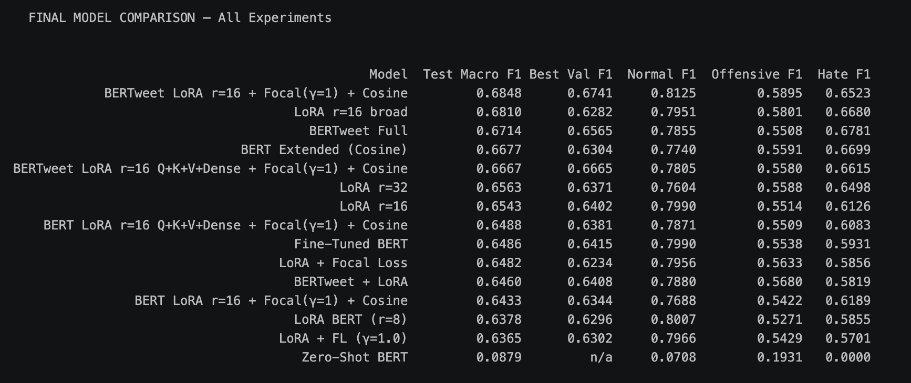
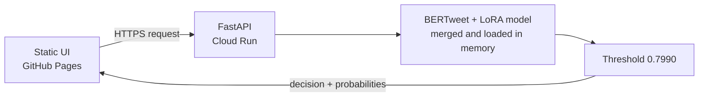

# BERTweet Guard — BERTweet + LoRA Text Moderation

An end-to-end AI model development project for fine-tuning **BERTweet** with **LoRA** on a multi-source moderation corpus, using source/class-weighted sampling, cross-entropy training, validation-calibrated decision thresholds, and deployment-focused artifact verification.

The central focus of this repository is the **machine-learning work**: controlled experimentation, dataset redesign, efficient fine-tuning, source-aware evaluation, threshold optimization, robustness testing, and export of a reusable moderation model. The FastAPI service, Docker image, CI/CD pipeline, and Cloud Run deployment complete the project by making the trained model usable outside a notebook.

> **Live application:** [bertweet.anutej.us](http://bertweet.anutej.us/)  
> **Frontend repository:** [bertweet-guard-ui](https://github.com/anutej-kardele/bertweet-guard-ui)  
> **Model repository:** [`anutej9/bertweet-guard`](https://huggingface.co/anutej9/bertweet-guard)

| Project area | Current choice |
| --- | --- |
| Backbone | `vinai/bertweet-base` |
| Fine-tuning method | LoRA, `r=32` |
| Training corpus | Jigsaw + HateXplain + Davidson + TweetEval Offensive |
| Training sampler | Inverse `(source, label)` frequency weighted sampling |
| Training loss | Cross-Entropy |
| Checkpoint selection | Source-balanced validation Macro F1 |
| Production task | Binary moderation: `normal` vs. `flagged` |
| Deployed decision threshold | `0.7990` |
| Test Overall Macro F1 | **0.9054** |
| Test Source-Balanced Macro F1 | **0.8309** |
| Final artifact regression suite | **15 / 15** |
| Inference service | FastAPI on Google Cloud Run |

---

## 1. Project Motivation

Content moderation is not only a deployment problem. The main challenge is building a model that can detect harmful language while avoiding false positives on ordinary discussion, longer posts, technical writing, opinions, and other benign social-media content.

The project developed through three research stages:

1. **Experiment broadly on the smaller THOS dataset** to compare BERT, BERTweet, full fine-tuning, LoRA configurations, loss functions, schedulers, and training choices.
2. **Scale the strongest direction to Jigsaw Toxic Comment Classification** and establish a strong large-dataset baseline.
3. **Redesign the production training corpus around four complementary datasets** after deployment testing exposed weaknesses that were not visible from Jigsaw-only benchmark scores.

The current model therefore keeps the useful toxicity and threat coverage from Jigsaw while adding several social-media datasets to better match the language expected in OpenStream and other short-form user-generated applications.

The resulting model is exposed through an API and separate browser interface, but those deployment components support the primary objective: producing a practical, reusable text-moderation model.

---

## 2. Research Journey

### Phase 1 — THOS experimentation

> **Public repository note:** The THOS work was completed as part of a university project. The original THOS notebook and university-project implementation are not included in this public repository. Only a high-level summary of the experiments, results, and conclusions is documented here.

THOS provided a smaller and faster environment for comparing ideas before committing compute to larger datasets.

The THOS task used three classes:

- `normal`
- `offensive`
- `hate`

The goal was not to choose BERTweet in advance. Multiple approaches were tested to identify which decisions consistently improved minority-class performance and overall Macro F1.

Experiments included:

- Zero-shot BERT
- Full BERT fine-tuning
- LoRA fine-tuning
- LoRA rank experiments using `r=8`, `r=16`, and `r=32`
- Focal Loss
- Focal Loss gamma experiments
- BERTweet
- Full BERTweet fine-tuning
- BERTweet + LoRA
- Broader LoRA target modules
- Cosine learning-rate scheduling
- Early stopping
- Longer training
- Attention visualization
- Fairness analysis

### Strongest THOS result

The best-performing THOS configuration was:

**BERTweet + LoRA `r=16` + Focal Loss (`γ=1`) + Cosine Scheduler**

| Metric | Score |
| --- | ---: |
| Test Macro F1 | **0.6848** |
| Best Validation F1 | 0.6741 |
| Normal F1 | 0.8125 |
| Offensive F1 | 0.5895 |
| Hate F1 | 0.6523 |



<details>
<summary><strong>Full THOS experiment comparison</strong></summary>

| Model | Test Macro F1 | Best Val F1 | Normal F1 | Offensive F1 | Hate F1 |
| --- | ---: | ---: | ---: | ---: | ---: |
| **BERTweet LoRA r=16 + Focal(γ=1) + Cosine** | **0.6848** | 0.6741 | 0.8125 | 0.5895 | 0.6523 |
| LoRA r=16 broad | 0.6810 | 0.6282 | 0.7951 | 0.5801 | 0.6680 |
| BERTweet Full | 0.6714 | 0.6565 | 0.7855 | 0.5508 | 0.6781 |
| BERT Extended (Cosine) | 0.6677 | 0.6304 | 0.7740 | 0.5591 | 0.6699 |
| BERTweet LoRA r=16 Q+K+V+Dense + Focal(γ=1) + Cosine | 0.6667 | 0.6665 | 0.7805 | 0.5580 | 0.6615 |
| LoRA r=32 | 0.6563 | 0.6371 | 0.7604 | 0.5588 | 0.6498 |
| LoRA r=16 | 0.6543 | 0.6402 | 0.7990 | 0.5514 | 0.6126 |
| BERT LoRA r=16 Q+K+V+Dense + Focal(γ=1) + Cosine | 0.6488 | 0.6381 | 0.7871 | 0.5509 | 0.6083 |
| Fine-Tuned BERT | 0.6486 | 0.6415 | 0.7990 | 0.5538 | 0.5931 |
| LoRA + Focal Loss | 0.6482 | 0.6234 | 0.7956 | 0.5633 | 0.5856 |
| BERTweet + LoRA | 0.6460 | 0.6408 | 0.7880 | 0.5680 | 0.5819 |
| BERT LoRA r=16 + Focal(γ=1) + Cosine | 0.6433 | 0.6344 | 0.7688 | 0.5422 | 0.6189 |
| LoRA BERT (r=8) | 0.6378 | 0.6296 | 0.8007 | 0.5271 | 0.5855 |
| LoRA + FL (γ=1.0) | 0.6365 | 0.6302 | 0.7966 | 0.5429 | 0.5701 |
| Zero-Shot BERT | 0.0879 | n/a | 0.0708 | 0.1931 | 0.0000 |

</details>

These experiments established the initial direction:

```text
BERTweet
    +
LoRA
    +
careful imbalance handling
    +
cosine learning-rate scheduling
```

The later stages retained BERTweet + LoRA while changing the data and optimization strategy when larger-scale evidence showed that the original training setup was not sufficient for production behavior.

---

### Phase 2 — Scaling to Jigsaw

The next stage moved to the much larger **Jigsaw Toxic Comment Classification** dataset.

Jigsaw's source labels were collapsed into the binary production target:

```text
normal  = 0
flagged = 1
```

A comment was marked `flagged` when any of these labels was positive:

- `toxic`
- `severe_toxic`
- `threat`
- `obscene`
- `insult`
- `identity_hate`

The Jigsaw-only model produced a strong held-out benchmark:

| Metric | Result |
| --- | ---: |
| Threshold-tuned validation Macro F1 | **0.9185** |
| Test Macro F1 | **0.9174** |
| Test accuracy | **0.9710** |
| Selected threshold | 0.62 |
| Flagged precision | 0.89 |
| Flagged recall | 0.81 |
| Flagged F1 | 0.85 |

However, production-style testing exposed an important limitation: a high in-domain Jigsaw test score did not guarantee reliable behavior on OpenStream-style posts.

Longer benign technical and conversational statements were sometimes assigned unexpectedly high flagged probabilities. This shifted the project from optimizing only a single-dataset benchmark toward evaluating **cross-domain generalization, source balance, sentence length, and deployment behavior**.

---

### Phase 3 — Current four-source moderation model

The current model combines four complementary datasets:

1. **Jigsaw Toxic Comment Classification**  
   Broad toxicity, threat, obscenity, insult, and identity-hate coverage.

2. **HateXplain**  
   Twitter/Gab posts annotated as hate speech, offensive language, or normal.

3. **Davidson Hate Speech & Offensive Language**  
   Twitter posts labeled as hate speech, offensive language, or neither.

4. **TweetEval Offensive**  
   Twitter offensive/non-offensive benchmark data.

All four are mapped to the same production contract:

```text
normal  = 0
flagged = 1
```

`TweetEval Offensive` already represents the OffensEval/OLID task, so OLID is not included again as a separate source.

After cross-source de-duplication, the combined corpus contains:

```text
217,270 unique labeled examples
```

with source-aware splits:

| Split | Rows |
| --- | ---: |
| Train | **195,542** |
| Validation | **10,863** |
| Test | **10,865** |

Every source is independently split **90 / 5 / 5** before the corresponding partitions are combined.

No destructive majority-class downsampling is performed.

---

## 3. Why the Current Modeling Choices?

### BERTweet

BERTweet is a transformer model pretrained on English tweets. Its pretraining domain makes it a natural candidate for short, informal, user-generated text containing unconventional punctuation, abbreviations, mentions, and other social-media patterns.

### LoRA

Low-Rank Adaptation adds trainable low-rank matrices to selected transformer modules while leaving most pretrained parameters frozen. The current setup trains approximately **5.9 million parameters** out of roughly **140.8 million total parameters**.

### Four-source training corpus

Jigsaw provides large-scale toxicity coverage, while HateXplain, Davidson, and TweetEval add social-media language and offensive-language supervision.

Using the four sources together gives the model a broader moderation signal than relying on a single dataset.

### Source/class-weighted sampling

Jigsaw is much larger than the other datasets, and the class distributions differ substantially across sources.

Instead of deleting examples, the training loader uses `WeightedRandomSampler` with weights inversely proportional to each `(source, label)` group size.

This means:

- all training rows remain available,
- smaller sources receive meaningful exposure,
- `normal` and `flagged` examples are balanced through sampling rather than destructive downsampling, and
- Jigsaw cannot dominate training simply because it contains more rows.

### Cross-Entropy

The current model uses standard:

```python
CrossEntropyLoss()
```

with no additional class weights.

Class/source balancing is handled by the sampler rather than combining weighted sampling with an additional class-weighted loss.

### Source-balanced Macro F1

Overall Macro F1 can still be dominated by the largest source.

Checkpoint selection and threshold optimization therefore use the **mean Macro F1 across the four validation sources**.

This gives Jigsaw, HateXplain, Davidson, and TweetEval equal importance when choosing the model checkpoint and deployment threshold.

### Cosine scheduling with warmup

The optimizer uses cosine learning-rate decay with a 6% warmup period. This preserves the stable scheduling strategy that performed well during the earlier experiments.

---

## 4. Current Training Configuration

| Component | Value |
| --- | --- |
| Backbone | `vinai/bertweet-base` |
| Task | Binary sequence classification |
| Labels | `normal`, `flagged` |
| Maximum sequence length | 128 |
| Batch size | 32 |
| LoRA rank | 32 |
| LoRA alpha | 64 |
| LoRA dropout | 0.20 |
| LoRA targets | `query`, `key`, `value`, `dense` |
| Loss | `CrossEntropyLoss` |
| Extra class weights | None |
| Train sampling | Inverse `(source, label)` frequency |
| Learning rate | `5e-5` |
| Weight decay | `0.05` |
| Maximum epochs | 5 |
| Early-stopping patience | 2 |
| Scheduler | Cosine with warmup |
| Warmup ratio | 0.06 |
| Random seed | 42 |
| Checkpoint metric | Source-balanced validation Macro F1 |
| Threshold metric | Source-balanced validation Macro F1 |

The selected checkpoint came from epoch 4:

```text
Source-balanced Val Macro F1 = 0.8381
Overall Val Macro F1         = 0.9069
Validation threshold         = 0.800
```

A fine-grained validation sweep then selected the final deployment threshold:

```text
0.799
```

---

## 5. End-to-End Modeling Pipeline

```text
Jigsaw + HateXplain + Davidson + TweetEval Offensive
        ↓
Unified binary labels: normal / flagged
        ↓
Cross-source de-duplication
        ↓
Source-aware 90 / 5 / 5 splitting
        ↓
Minimal BERTweet-aligned preprocessing
        ↓
BERTweet tokenizer
        ↓
Source/class-weighted training sampler
        ↓
BERTweet + LoRA fine-tuning
        ↓
Cross-Entropy
        ↓
Cosine learning-rate schedule + warmup
        ↓
Validation probabilities by source
        ↓
Source-balanced checkpoint selection
        ↓
Source-balanced threshold optimization
        ↓
Held-out test evaluation
        ↓
Length-bias and source-wise diagnostics
        ↓
Merge LoRA adapters into BERTweet
        ↓
Clean model + tokenizer artifact export
        ↓
Tokenizer consistency gate
        ↓
15-case final-artifact regression suite
        ↓
Package / upload to Hugging Face
        ↓
Serve through FastAPI
```

The decision threshold and tokenizer behavior are treated as part of the deployment artifact, not as unrelated API settings.

---

## 6. Decision-Threshold Optimization

The service does not simply use:

```python
prediction = logits.argmax()
```

Instead, it computes the probability of the `flagged` class and compares it with the validation-selected threshold:

```python
prediction = int(flagged_probability >= decision_threshold)
```

The current threshold is:

```text
0.7990
```

The threshold was selected on validation predictions using the **source-balanced Macro F1** objective.

This is important because the four validation sources have very different sizes. Optimizing only the combined validation set would allow the much larger Jigsaw partition to influence the operating point more strongly than the social-media datasets.

The test set is not used to choose the threshold.

---

## 7. Current Results

### Overall test results

| Metric | Result |
| --- | ---: |
| Overall Test Macro F1 | **0.9054** |
| Source-Balanced Test Macro F1 | **0.8309** |
| Test Accuracy | **0.9301** |
| Normal precision | 0.9552 |
| Normal recall | 0.9523 |
| Normal F1 | **0.9538** |
| Flagged precision | 0.8529 |
| Flagged recall | 0.8610 |
| Flagged F1 | **0.8569** |
| Selected threshold | **0.7990** |

### Per-source test performance

| Source | Macro F1 | Accuracy |
| --- | ---: | ---: |
| Davidson | **0.9017** | 0.9411 |
| Jigsaw | **0.9015** | 0.9611 |
| TweetEval Offensive | 0.7614 | 0.7903 |
| HateXplain | 0.7591 | 0.7615 |

The difference between **Overall Macro F1** and **Source-Balanced Macro F1** is intentional and useful.

The overall metric describes performance across all held-out examples, while the source-balanced metric gives each dataset equal weight and therefore better exposes cross-domain weaknesses.

---

## 8. Long-Text False-Positive Diagnostic

A major motivation for the current training redesign was false-positive behavior on longer benign statements.

The current model explicitly measures the false-positive rate on **known-normal test examples** across token-length bins.

| Normal-text token length | Samples | Avg. flagged probability | False-positive rate |
| --- | ---: | ---: | ---: |
| ≤ 8 | 213 | 0.0950 | 6.57% |
| 8–16 | 1,022 | 0.0953 | 7.34% |
| 16–32 | 1,803 | 0.0851 | 5.44% |
| 32–64 | 2,215 | 0.0782 | 5.46% |
| 64–96 | 1,032 | 0.0563 | 3.20% |
| 96–128 | 605 | 0.0641 | 2.64% |
| >128 | 1,335 | 0.0661 | 2.62% |

Correlation between token length and flagged probability for normal held-out examples:

```text
-0.0173
```

The value is close to zero, and the false-positive rate does not increase with longer normal text in the current held-out test.

This diagnostic is retained because a single overall benchmark score would not reveal this type of deployment failure.

---

## 9. Final-Artifact Regression Suite

Before the model is packaged, the notebook reloads the final disk artifact and runs a fixed **15-example regression suite**.

The suite contains:

- 10 longer statements,
- 5 shorter statements,
- benign technical/conversational posts,
- ordinary opinions,
- protest/political discussion,
- insults,
- abuse, and
- threats.

Current result:

```text
15 / 15 PASS
```

Representative final-artifact outputs:

| Text | Expected | Flagged probability | Result |
| --- | --- | ---: | --- |
| `Cold starts are a tax you pay for free hosting...` | normal | 0.0021 | PASS |
| `Tried explaining JOIN FETCH to someone...` | normal | 0.0068 | PASS |
| `I am going to attend the protest against the governor...` | normal | 0.0019 | PASS |
| `You keep ruining every task you touch...` | flagged | 0.8945 | PASS |
| `If that person comes near me again I am going to hurt them badly...` | flagged | 0.9646 | PASS |
| `you are an idiot` | flagged | 0.9944 | PASS |
| `I want to kill the person` | flagged | 0.9977 | PASS |

These examples are used as a **regression suite**, not as training data or a threshold-tuning set.

---

## 10. Research Notebook

### `bertweet_moderation_model.ipynb`

The current public training notebook includes:

- four-source dataset loading,
- binary-label harmonization,
- cross-source de-duplication,
- source-aware 90 / 5 / 5 splitting,
- BERTweet-aligned preprocessing,
- sequence-length diagnostics,
- source/class-weighted training,
- BERTweet + LoRA fine-tuning,
- Cross-Entropy,
- cosine scheduling with warmup,
- source-balanced checkpoint selection,
- fine-grained threshold optimization,
- overall and source-balanced evaluation,
- per-source test metrics,
- long-text false-positive diagnostics,
- LoRA merge,
- production artifact export,
- tokenizer consistency verification,
- 15-case final-artifact regression testing, and
- downloadable model packaging.

Use this notebook for the current training and retraining workflow.

### Public repository boundary

The earlier THOS work was completed as part of university coursework. Its source notebook, assignment material, and implementation are intentionally excluded to comply with the university's terms.

This README retains the THOS experiment summary because it explains how BERTweet + LoRA emerged as the modeling direction, while the public notebook represents the **current multi-source training system**.

---

## 11. Evaluation Methodology

Every source is independently divided into:

```text
90% training
 5% validation
 5% test
```

The corresponding source partitions are then combined.

```text
Training set
    → parameter optimization through weighted sampling

Validation set
    → checkpoint selection
    → decision-threshold selection

Test set
    → final evaluation only
    → per-source evaluation
    → length-bias diagnostics
```

The test set is not used to choose:

- epochs,
- LoRA parameters,
- sampling weights,
- learning rate,
- decision threshold, or
- checkpoint.

### Two validation metrics

The notebook tracks:

1. **Overall Macro F1**
2. **Source-Balanced Macro F1**

Source-Balanced Macro F1 is calculated by evaluating each source independently and averaging the resulting Macro F1 scores.

This is the primary checkpoint-selection metric.

### Reproducibility

The workflow uses:

```python
RANDOM_SEED = 42
```

For fair comparisons, keep the following fixed unless they are the explicit subject of an experiment:

- source datasets,
- dataset split,
- random seed,
- preprocessing,
- source/class sampling strategy,
- evaluation metric,
- threshold-selection procedure, and
- test-set isolation.

---

## 12. Model Export and Tokenizer Verification

After evaluation, the LoRA adapters are merged into the BERTweet backbone.

The export contains:

- merged model weights,
- model configuration,
- original BERTweet `vocab.txt`,
- original BERTweet `bpe.codes`,
- tokenizer metadata,
- label mappings,
- `threshold.json`,
- training/evaluation metadata, and
- the LoRA adapter for future continued training.

The exported artifact is uploaded to:

```text
anutej9/bertweet-guard
```

### Why the tokenizer export is handled explicitly

During deployment verification, re-saving the BERTweet tokenizer changed the produced token IDs and therefore changed the model probabilities.

The current workflow avoids that failure mode:

1. save the merged model into a clean artifact directory,
2. copy the original `vocab.txt` and `bpe.codes` directly from `vinai/bertweet-base`,
3. load the exported tokenizer explicitly with `BertweetTokenizer`,
4. compare token IDs and attention masks against the training tokenizer, and
5. stop packaging if any mismatch is detected.

The final artifact passed the tokenizer consistency gate on representative short and long examples.

### Loading from Hugging Face

```python
from transformers import (
    BertweetTokenizer,
    AutoModelForSequenceClassification,
)

model_id = "anutej9/bertweet-guard"

tokenizer = BertweetTokenizer.from_pretrained(
    model_id,
    normalization=True,
)

model = AutoModelForSequenceClassification.from_pretrained(
    model_id,
)
```

The backend also reads `threshold.json` from the same model repository.

For local development, Transformers downloads and caches the model on first use. For the production Cloud Run deployment, the model can be included in the Docker image so a new container does not need to download the model weights at runtime.

---

## 13. Repository Structure

```text
bertweet-guard/
├── app/
│   ├── __init__.py
│   ├── config.py          # Settings and environment parsing
│   ├── main.py            # FastAPI app and lifespan model loading
│   ├── model.py           # Transformers inference and threshold logic
│   └── schemas.py         # Pydantic request/response schemas
│
├── notebooks/
│   └── bertweet_moderation_model.ipynb
│
├── docs/
│   └── thos_model_comparison.png
│
├── Dockerfile             # Production inference image
├── .env.example           # Local environment template
├── requirements.txt
├── setup.sh               # Local environment setup
├── launch.sh              # API and notebook launcher
└── README.md
```

The repository separates:

- **current model research and training** under `notebooks/`,
- **historical experiment documentation** under `docs/`,
- **production inference** under `app/`, and
- **containerized deployment** through the `Dockerfile`.

The browser interface lives independently in [bertweet-guard-ui](https://github.com/anutej-kardele/bertweet-guard-ui).

---

## 14. Local Setup

### Prerequisites

- Python 3.10 or newer
- Git
- Internet access for the first Hugging Face model download
- A GPU is strongly recommended for retraining
- Inference can run on a CPU, although it will be slower

### Clone the repository

```bash
git clone https://github.com/anutej-kardele/bertweet-guard.git
cd bertweet-guard
```

### Automated setup

```bash
chmod +x setup.sh launch.sh
./setup.sh
```

The setup script:

1. creates `.venv`,
2. installs the dependencies in `requirements.txt`,
3. creates `.env` from `.env.example` when necessary, and
4. runs an import and environment check.

### Manual setup

macOS or Linux:

```bash
python3 -m venv .venv
source .venv/bin/activate

python -m pip install --upgrade pip
pip install -r requirements.txt

cp .env.example .env
```

Windows PowerShell:

```powershell
py -m venv .venv
.venv\Scripts\Activate.ps1

python -m pip install --upgrade pip
pip install -r requirements.txt

copy .env.example .env
```

Example local configuration:

```ini
MODEL_ID="anutej9/bertweet-guard"
ENVIRONMENT="development"
```

### Start the inference API

```bash
./launch.sh api
```

Equivalent direct command:

```bash
uvicorn app.main:app --reload --host 0.0.0.0 --port 8000
```

Local endpoints:

- Swagger / OpenAPI documentation: `http://localhost:8000/docs`
- Health endpoint: `http://localhost:8000/health`
- Prediction endpoint: `http://localhost:8000/api/v1/predict`

### Open the training notebook

```bash
./launch.sh notebook
```

Or open the current notebook directly:

```bash
./launch.sh notebooks/bertweet_moderation_model.ipynb
```

---

## 15. API Reference

### Health check

```http
GET /health
```

This endpoint reports service availability and is also used by the external frontend to pre-warm a scaled-down Cloud Run instance.

### Analyze text

```http
POST /api/v1/predict
Content-Type: application/json
```

Request:

```json
{
  "text": "I am going to attend the protest against the governor this weekend because I want to hear what the speakers have to say."
}
```

Example response:

```json
{
  "prediction": "normal",
  "scores": {
    "normal": 0.9981,
    "flagged": 0.0019
  },
  "flagged": false,
  "threshold_info": {
    "threshold": 0.799,
    "margin": -0.7971
  }
}
```

The margin is calculated as:

```text
flagged probability - decision threshold
```

- positive margin → above the moderation threshold
- negative margin → below the moderation threshold

The probability and Boolean decision are both returned so another application can apply a stricter or more permissive review policy when needed.

---

## 16. Production Deployment

Deployment is the final stage of the model lifecycle rather than the primary purpose of the project.

### Architecture



### Backend infrastructure

- **Hosting:** Google Cloud Run in `us-east4`
- **Containerization:** Docker
- **CI/CD:** Google Cloud Build
- **Deployment trigger:** pushes to the `master` branch
- **Model initialization:** loaded once through FastAPI's lifespan handler
- **Scaling:** serverless scaling, including scale-to-zero while idle

The model can be built directly into the production image. This avoids downloading the model from Hugging Face every time Cloud Run creates a new instance and improves startup consistency.

### Frontend separation

The UI is maintained in the separate [bertweet-guard-ui](https://github.com/anutej-kardele/bertweet-guard-ui) repository and hosted at [bertweet.anutej.us](http://bertweet.anutej.us/).

When the page loads, the frontend immediately calls `/health`. If Cloud Run has scaled the API to zero, the request begins waking the model container while the user reads the interface.

---

## 17. Security and Privacy

- Cloud Run and GitHub Pages provide HTTPS for data in transit.
- Pydantic validates the structure and types of incoming request payloads.
- CORS middleware restricts which browser origins can call the API.
- The inference container is stateless.
- The application processes submitted text and returns a result without intentionally persisting the input.
- The browser frontend contains no API secrets or model credentials.

The service should still be protected with appropriate rate limiting, monitoring, quotas, and access controls before use in a high-volume or sensitive production environment.

---

## 18. Thresholds as Application Policy

The API exposes both the model probabilities and the deployed Boolean decision. This allows another application to build a multi-stage review policy around the classifier.

For example:

```text
flagged_probability >= 0.95
    → automatically reject

0.799 <= flagged_probability < 0.95
    → moderation review

flagged_probability < 0.799
    → allow under the model's default decision rule
```

These values are an example of application policy around the model. The validation-selected threshold remains `0.7990`.

---

## 19. Limitations and Responsible Use

This is an AI research and deployment project, not a complete moderation policy.

Known limitations include:

- the production output is binary rather than multi-policy,
- the four source datasets use different annotation schemes and collection domains,
- source-wise performance still varies, especially on HateXplain and TweetEval,
- social-media language changes over time,
- BERTweet has a relatively short sequence budget,
- text longer than 128 tokens is truncated during model input,
- sarcasm and implicit context remain difficult,
- quoted abuse can be mistaken for direct abuse,
- reclaimed language can be misclassified,
- one global threshold may not suit every application,
- the current model is primarily intended for English-language text, and
- the 15-case regression suite is a targeted engineering check rather than a substitute for a large independent production-domain test set.

For high-impact moderation, use the classifier as one signal in a broader system. Borderline and context-dependent cases should be sent to a human reviewer.

---

## 20. Summary

BERTweet Guard follows a **research → scale → diagnose → redesign → deploy** workflow:

```text
THOS experimentation
        ↓
Compare BERT, BERTweet, full fine-tuning, LoRA, loss variants, and schedulers
        ↓
Select BERTweet + LoRA as the core modeling direction
        ↓
Scale to Jigsaw Toxic Comment Classification
        ↓
Reach strong in-domain benchmark performance
        ↓
Test production-style text and identify generalization / false-positive weaknesses
        ↓
Combine Jigsaw + HateXplain + Davidson + TweetEval Offensive
        ↓
Keep all training rows and balance exposure with weighted sampling
        ↓
Train with Cross-Entropy + cosine warmup
        ↓
Select checkpoints and thresholds using source-balanced validation Macro F1
        ↓
Evaluate overall, per-source, and by normal-text length
        ↓
Merge LoRA and export a clean model artifact
        ↓
Verify BERTweet tokenizer consistency
        ↓
Run 15-case final-artifact regression suite
        ↓
Upload the reusable artifact to Hugging Face
        ↓
Serve through FastAPI, Docker, and Cloud Run
```

The deployed application demonstrates that the model can operate outside a notebook, but the main contribution of the project is the complete AI workflow: **comparative experimentation, dataset redesign, efficient fine-tuning, source-aware balancing, careful evaluation, threshold calibration, deployment diagnostics, and reproducible model export**.

---

## Public Release Scope

This repository contains the current four-source BERTweet training workflow in `bertweet_moderation_model.ipynb`, model documentation, exported-model integration, and inference API.

The earlier university THOS implementation is intentionally excluded; only its high-level comparison and conclusions are published to document how the project evolved into the current model.

## Author

Built by [Anutej Kardele](https://anutej.us).
