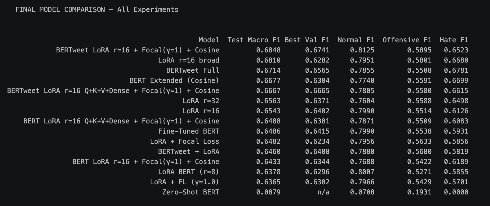
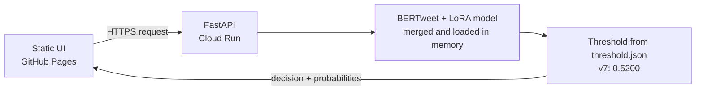

# BERTweet Guard — BERTweet + LoRA Text Moderation

An end-to-end AI model development project for fine-tuning **BERTweet** with **LoRA** on a multi-source moderation corpus, using source-aware and subtype-aware sampling, targeted threat/harassment robustness training, cross-entropy loss, validation-calibrated decision thresholds, and deployment-focused artifact verification.

The central focus of this repository is the **machine-learning work**: controlled experimentation, dataset redesign, efficient fine-tuning, source-aware evaluation, subtype diagnostics, threshold optimization, robustness testing, and export of a reusable moderation model. The FastAPI service, Docker image, CI/CD pipeline, and Cloud Run deployment complete the project by making the trained model usable outside a notebook.

> **Live application:** [bertweet.anutej.us](http://bertweet.anutej.us/)  
> **Frontend repository:** [bertweet-guard-ui](https://github.com/anutej-kardele/bertweet-guard-ui)  
> **Model repository:** [`anutej9/bertweet-guard`](https://huggingface.co/anutej9/bertweet-guard)

| Project area | Current choice |
| --- | --- |
| Backbone | `vinai/bertweet-base` |
| Fine-tuning method | LoRA, `r=32` |
| Training corpus | Jigsaw + HateXplain + Davidson + TweetEval Offensive |
| Production labels | Binary: `normal` / `flagged` |
| Training-only harm subtypes | `threat`, `hate`, `identity_hate`, `insult`, `obscene`, `offensive`, `severe_toxic`, `toxic` |
| Training sampler | Inverse `(source, label)` weighting + targeted threat/harassment/hard-negative boosts, normalized within source/class |
| Training loss | Cross-Entropy |
| Robustness augmentation | Class-conditional lowercase augmentation + terminal-punctuation augmentation |
| Checkpoint selection | Source-balanced validation Macro F1 |
| Current v7 decision threshold | **`0.5200`** |
| Test Overall Macro F1 | **0.9052** |
| Test Source-Balanced Macro F1 | **0.8368** |
| Test Accuracy | **0.9285** |
| Final artifact regression suite | **34 / 35** |
| Direct-threat case robustness | **100% pass rate**, probability range `0.0244` |
| Inference service | FastAPI on Google Cloud Run |

> **Version note:** The metrics and threshold in this README describe the current **v7 targeted-robustness artifact**. A running production service should be considered equivalent only after it is redeployed from the matching model artifact and `threshold.json`.

---

## 1. Project Motivation

Content moderation is not only a deployment problem. The main challenge is building a model that can detect harmful language while avoiding false positives on ordinary discussion, longer posts, technical writing, opinions, political disagreement, and benign uses of words that can also appear in harmful contexts.

The project developed through four research stages:

1. **Experiment broadly on the smaller THOS dataset** to compare BERT, BERTweet, full fine-tuning, LoRA configurations, loss functions, schedulers, and training choices.
2. **Scale the strongest direction to Jigsaw Toxic Comment Classification** and establish a strong large-dataset baseline.
3. **Redesign the production corpus around four complementary datasets** after deployment-style testing exposed weaknesses that were not visible from Jigsaw-only benchmark scores.
4. **Add subtype-aware and targeted robustness training** after v6/v7 testing exposed sensitivity to casing and weaker handling of direct threats and subtle harassment.

The current model therefore keeps the broad toxicity coverage of Jigsaw, adds social-media supervision from HateXplain, Davidson, and TweetEval, preserves harm subtypes during training, and deliberately increases exposure to rare threats and difficult directed-harassment cases.

The resulting model is exposed through an API and separate browser interface, but those deployment components support the primary objective: producing a practical, reusable moderation model whose behavior is measured beyond a single benchmark score.

---

## 2. Research Journey

### Phase 1 — THOS experimentation

> **Public repository note:** The THOS work was completed as part of a university project. The original THOS notebook and university-project implementation are not included in this public repository. Only a high-level summary of the experiments, results, and conclusions is documented here.

THOS provided a smaller and faster environment for comparing ideas before committing compute to larger datasets.

The THOS task used three classes:

- `normal`
- `offensive`
- `hate`

The goal was not to choose BERTweet in advance. Multiple approaches were tested to identify which decisions consistently improved minority-class performance and overall Macro F1.

Experiments included:

- Zero-shot BERT
- Full BERT fine-tuning
- LoRA fine-tuning
- LoRA rank experiments using `r=8`, `r=16`, and `r=32`
- Focal Loss
- Focal Loss gamma experiments
- BERTweet
- Full BERTweet fine-tuning
- BERTweet + LoRA
- Broader LoRA target modules
- Cosine learning-rate scheduling
- Early stopping
- Longer training
- Attention visualization
- Fairness analysis

### Strongest THOS result

The best-performing THOS configuration was:

**BERTweet + LoRA `r=16` + Focal Loss (`γ=1`) + Cosine Scheduler**

| Metric | Score |
| --- | ---: |
| Test Macro F1 | **0.6848** |
| Best Validation F1 | 0.6741 |
| Normal F1 | 0.8125 |
| Offensive F1 | 0.5895 |
| Hate F1 | 0.6523 |



<details>
<summary><strong>Full THOS experiment comparison</strong></summary>

| Model | Test Macro F1 | Best Val F1 | Normal F1 | Offensive F1 | Hate F1 |
| --- | ---: | ---: | ---: | ---: | ---: |
| **BERTweet LoRA r=16 + Focal(γ=1) + Cosine** | **0.6848** | 0.6741 | 0.8125 | 0.5895 | 0.6523 |
| LoRA r=16 broad | 0.6810 | 0.6282 | 0.7951 | 0.5801 | 0.6680 |
| BERTweet Full | 0.6714 | 0.6565 | 0.7855 | 0.5508 | 0.6781 |
| BERT Extended (Cosine) | 0.6677 | 0.6304 | 0.7740 | 0.5591 | 0.6699 |
| BERTweet LoRA r=16 Q+K+V+Dense + Focal(γ=1) + Cosine | 0.6667 | 0.6665 | 0.7805 | 0.5580 | 0.6615 |
| LoRA r=32 | 0.6563 | 0.6371 | 0.7604 | 0.5588 | 0.6498 |
| LoRA r=16 | 0.6543 | 0.6402 | 0.7990 | 0.5514 | 0.6126 |
| BERT LoRA r=16 Q+K+V+Dense + Focal(γ=1) + Cosine | 0.6488 | 0.6381 | 0.7871 | 0.5509 | 0.6083 |
| Fine-Tuned BERT | 0.6486 | 0.6415 | 0.7990 | 0.5538 | 0.5931 |
| LoRA + Focal Loss | 0.6482 | 0.6234 | 0.7956 | 0.5633 | 0.5856 |
| BERTweet + LoRA | 0.6460 | 0.6408 | 0.7880 | 0.5680 | 0.5819 |
| BERT LoRA r=16 + Focal(γ=1) + Cosine | 0.6433 | 0.6344 | 0.7688 | 0.5422 | 0.6189 |
| LoRA BERT (r=8) | 0.6378 | 0.6296 | 0.8007 | 0.5271 | 0.5855 |
| LoRA + FL (γ=1.0) | 0.6365 | 0.6302 | 0.7966 | 0.5429 | 0.5701 |
| Zero-Shot BERT | 0.0879 | n/a | 0.0708 | 0.1931 | 0.0000 |

</details>

These experiments established the initial direction:

```text
BERTweet
    +
LoRA
    +
careful imbalance handling
    +
cosine learning-rate scheduling
```

The later stages retained BERTweet + LoRA while changing the data and optimization strategy when larger-scale evidence showed that the original training setup was not sufficient for production behavior.

---

### Phase 2 — Scaling to Jigsaw

The next stage moved to the much larger **Jigsaw Toxic Comment Classification** dataset.

Jigsaw's source labels were collapsed into the binary production target:

```text
normal  = 0
flagged = 1
```

A comment was marked `flagged` when any of these labels was positive:

- `toxic`
- `severe_toxic`
- `threat`
- `obscene`
- `insult`
- `identity_hate`

The Jigsaw-only model produced a strong held-out benchmark:

| Metric | Result |
| --- | ---: |
| Threshold-tuned validation Macro F1 | **0.9185** |
| Test Macro F1 | **0.9174** |
| Test accuracy | **0.9710** |
| Selected threshold | 0.62 |
| Flagged precision | 0.89 |
| Flagged recall | 0.81 |
| Flagged F1 | 0.85 |

However, production-style testing exposed an important limitation: a high in-domain Jigsaw test score did not guarantee reliable behavior on OpenStream-style posts.

Longer benign technical and conversational statements were sometimes assigned unexpectedly high flagged probabilities. This shifted the project from optimizing only a single-dataset benchmark toward evaluating **cross-domain generalization, source balance, sentence length, and deployment behavior**.

---

### Phase 3 — Four-source production redesign

The current model combines four complementary datasets:

1. **Jigsaw Toxic Comment Classification**  
   Broad toxicity, threat, obscenity, insult, and identity-hate coverage.

2. **HateXplain**  
   Twitter/Gab posts annotated as hate speech, offensive language, or normal.

3. **Davidson Hate Speech & Offensive Language**  
   Twitter posts labeled as hate speech, offensive language, or neither.

4. **TweetEval Offensive**  
   Twitter offensive/non-offensive benchmark data.

All four are mapped to the same production contract:

```text
normal  = 0
flagged = 1
```

`TweetEval Offensive` already represents the OffensEval/OLID task, so OLID is not included again as a separate source.

After cross-source de-duplication, the combined corpus contains:

```text
217,270 unique labeled examples
```

with source-aware splits:

| Split | Rows |
| --- | ---: |
| Train | **195,542** |
| Validation | **10,863** |
| Test | **10,865** |

Every source is independently split **90 / 5 / 5** before the corresponding partitions are combined.

No destructive majority-class downsampling is performed.

---


### Phase 4 — targeted robustness training

The four-source redesign removed the earlier long-text bias, but production-style regression testing exposed a different weakness: semantically equivalent harmful statements could receive very different probabilities when casing or wording changed.

For example, an earlier v7 run handled title-case direct threats strongly while assigning much lower confidence to an equivalent lowercase version. It also remained much stronger on explicit insults than on subtle directed harassment.

The current v7 iteration keeps the binary production task unchanged but adds training-only structure:

```text
binary label
    +
retained harm subtype
    +
training-focus heuristic
```

Rare `threat` examples receive additional sampling emphasis. Directed harassment receives extra exposure, and flagged examples that address another person without obvious profanity are treated as **subtle directed harassment** for sampler purposes.

The model also keeps extra exposure to normal examples containing words such as `kill`, `killing`, `hurt`, `attack`, `threat`, or `violence`. These hard negatives help the model distinguish actual harmful intent from benign technical or contextual uses.

Finally, lowercase augmentation is applied more aggressively to harmful examples than normal examples. This directly targets the case-sensitivity observed in earlier testing while keeping production preprocessing minimal.

The production output remains:

```text
normal  = 0
flagged = 1
```

The subtypes and focus groups exist only during training and diagnostics; they do not change the public API contract.

---

## 3. Why the Current Modeling Choices?

### BERTweet

BERTweet is a transformer model pretrained on English tweets. Its pretraining domain makes it a natural candidate for short, informal, user-generated text containing unconventional punctuation, abbreviations, mentions, and other social-media patterns.

### LoRA

Low-Rank Adaptation adds trainable low-rank matrices to selected transformer modules while leaving most pretrained parameters frozen. The current setup uses LoRA rank `32`, alpha `64`, dropout `0.20`, and targets the `query`, `key`, `value`, and `dense` modules.

### Four-source training corpus

Jigsaw provides large-scale toxicity coverage, while HateXplain, Davidson, and TweetEval add social-media language and offensive-language supervision.

Using the four sources together gives the model a broader moderation signal than relying on a single dataset.

### Retained harm subtypes

The serving task is binary, but the training pipeline does not immediately discard all annotation structure.

The current workflow retains a primary training-only subtype such as:

```text
threat
identity_hate
hate
severe_toxic
insult
obscene
offensive
toxic
normal
```

For Jigsaw examples with several positive labels, a priority rule preserves the most operationally useful subtype before the example is collapsed to the binary `flagged` target.

This makes it possible to measure and rebalance rare harm categories without changing the deployed output schema.

### Targeted source/class sampling

Jigsaw is much larger than the other datasets, and the class distributions differ substantially across sources.

The loader begins with inverse `(source, label)` weighting so each source/class group receives meaningful exposure. It then redistributes probability **inside** those groups using capped boosts for difficult training categories:

| Training focus | Multiplier |
| --- | ---: |
| Threat | `2.50x` |
| Subtle directed harassment | `2.00x` |
| Directed harassment | `1.40x` |
| Normal violence hard-negative | `1.75x` |

Subtype rarity can contribute an additional boost, capped at `6.0x`, while the combined row-level boost is capped at `8.0x`.

Crucially, the final boosts are normalized back to a mean of `1.0` inside every `(source, label)` group. That preserves source/class balance: the strategy changes the **composition** of examples sampled within a group rather than simply increasing the total mass of the flagged class.

### Class-conditional robustness augmentation

The first v7 run showed that uniform lowercase augmentation was not enough to remove case sensitivity.

The current training loader therefore applies lowercase augmentation according to the example's training focus:

| Training focus | Lowercase probability |
| --- | ---: |
| Normal | 10% |
| Other flagged | 35% |
| Directed harassment | 50% |
| Subtle directed harassment | 50% |
| Threat | 65% |

A `15%` terminal-punctuation-drop augmentation is also retained.

These transformations are **training-only**. Validation, held-out testing, exported-artifact verification, and production inference use the original text with minimal whitespace cleanup.

### Cross-Entropy

The current model uses standard:

```python
CrossEntropyLoss()
```

with no additional class weights.

Class/source/subtype exposure is handled by the sampler rather than stacking a class-weighted loss on top of weighted sampling.

### Source-balanced Macro F1

Overall Macro F1 can still be dominated by the largest source.

Checkpoint selection and threshold optimization therefore use the **mean Macro F1 across the four validation sources**.

This gives Jigsaw, HateXplain, Davidson, and TweetEval equal importance when choosing the model checkpoint and deployment threshold.

### Cosine scheduling with warmup

The optimizer uses cosine learning-rate decay with a 6% warmup period. This preserves the stable scheduling strategy that performed well during the earlier experiments.

---

## 4. Current Training Configuration

| Component | Value |
| --- | --- |
| Backbone | `vinai/bertweet-base` |
| Task | Binary sequence classification |
| Labels | `normal`, `flagged` |
| Maximum sequence length | 128 |
| Batch size | 32 |
| LoRA rank | 32 |
| LoRA alpha | 64 |
| LoRA dropout | 0.20 |
| LoRA targets | `query`, `key`, `value`, `dense` |
| Loss | `CrossEntropyLoss` |
| Extra class weights | None |
| Base train sampling | Inverse `(source, label)` frequency |
| Subtype boost cap | `6.0` |
| Combined sample boost cap | `8.0` |
| Threat focus multiplier | `2.50` |
| Subtle-harassment focus multiplier | `2.00` |
| Directed-harassment focus multiplier | `1.40` |
| Normal violence hard-negative multiplier | `1.75` |
| Lowercase augmentation — normal | `0.10` |
| Lowercase augmentation — other flagged | `0.35` |
| Lowercase augmentation — directed/subtle harassment | `0.50` |
| Lowercase augmentation — threat | `0.65` |
| Terminal punctuation drop | `0.15` |
| Learning rate | `5e-5` |
| Weight decay | `0.05` |
| Maximum epochs | 5 |
| Early-stopping patience | 2 |
| Scheduler | Cosine with warmup |
| Warmup ratio | 0.06 |
| Random seed | 42 |
| Checkpoint metric | Source-balanced validation Macro F1 |
| Threshold metric | Source-balanced validation Macro F1 |

The selected checkpoint came from epoch 4:

```text
Source-balanced Val Macro F1 = 0.8406
Overall Val Macro F1         = 0.9045
Validation threshold         = 0.520
```

Training ran for all five epochs. The best source-balanced validation checkpoint remained epoch 4 even though epoch 5 reached a slightly higher combined validation Macro F1.

Warmup:

```text
1,833 / 30,555 optimizer steps
```

The validation-selected threshold packaged with the v7 artifact is:

```text
0.520
```

---

## 5. End-to-End Modeling Pipeline

```text
Jigsaw + HateXplain + Davidson + TweetEval Offensive
        ↓
Unified binary labels: normal / flagged
        ↓
Retain training-only harm subtype
        ↓
Cross-source de-duplication
        ↓
Source-aware 90 / 5 / 5 splitting
        ↓
Subtype stratification where safe
        ↓
Minimal BERTweet-aligned preprocessing
        ↓
BERTweet tokenizer
        ↓
Targeted source/class/subtype weighted sampler
        ↓
Class-conditional lowercase augmentation
+ terminal-punctuation augmentation
        ↓
BERTweet + LoRA fine-tuning
        ↓
Cross-Entropy
        ↓
Cosine learning-rate schedule + warmup
        ↓
Validation probabilities by source
        ↓
Source-balanced checkpoint selection
        ↓
Source-balanced threshold optimization
        ↓
Held-out test evaluation
        ↓
Per-source + harm-subtype diagnostics
        ↓
Normal-text length / false-positive diagnostics
        ↓
Merge LoRA adapters into BERTweet
        ↓
Clean model + tokenizer artifact export
        ↓
Tokenizer consistency hard gate
        ↓
35-case final-artifact regression suite
        ↓
Grouped robustness diagnostics
        ↓
Package / upload to Hugging Face
        ↓
Serve through FastAPI
```

The decision threshold and tokenizer behavior are treated as part of the deployment artifact, not as unrelated API settings.

The harm subtypes, focus groups, and augmentation logic are training/evaluation concerns only. Production continues to expose the same binary API contract.

---

## 6. Decision-Threshold Optimization

The service does not simply use:

```python
prediction = logits.argmax()
```

Instead, it computes the probability of the `flagged` class and compares it with the validation-selected threshold:

```python
prediction = int(flagged_probability >= decision_threshold)
```

The current v7 threshold is:

```text
0.5200
```

The threshold was selected from validation predictions using the **source-balanced Macro F1** objective.

This matters because the four validation sources have very different sizes. Optimizing only the combined validation set would allow the much larger Jigsaw partition to influence the operating point more strongly than the social-media datasets.

Thresholds are checkpoint-specific. During the five-epoch run, validation-optimal thresholds moved between approximately `0.520` and `0.760`; the selected epoch-4 checkpoint is paired with `0.520`.

The test set and the handcrafted regression/robustness suites are **not** used to choose the threshold.

The exported `threshold.json` must therefore travel with the exact model weights used to produce it.

---

## 7. Current Results

### Overall held-out test results

| Metric | Result |
| --- | ---: |
| Overall Test Macro F1 | **0.9052** |
| Source-Balanced Test Macro F1 | **0.8368** |
| Test Accuracy | **0.9285** |
| Normal precision | 0.9638 |
| Normal recall | 0.9409 |
| Normal F1 | **0.9522** |
| Flagged precision | 0.8286 |
| Flagged recall | **0.8898** |
| Flagged F1 | **0.8581** |
| Selected threshold | **0.5200** |

The overall metric describes performance across all held-out examples, while the source-balanced metric gives each dataset equal weight and therefore better exposes cross-domain weaknesses.

### Per-source test performance

| Source | Examples | Macro F1 | Accuracy |
| --- | ---: | ---: | ---: |
| Davidson | 1,239 | **0.9085** | 0.9467 |
| Jigsaw | 7,965 | **0.8911** | 0.9546 |
| HateXplain | 960 | 0.7820 | 0.7865 |
| TweetEval Offensive | 701 | 0.7655 | 0.7946 |

### Harm-subtype held-out diagnostics

The deployed task remains binary, but the retained training subtype makes it possible to inspect whether the model is consistently detecting different kinds of harmful content.

| Subtype | Examples | Avg. flagged probability | Flagged recall |
| --- | ---: | ---: | ---: |
| Threat | 23 | **0.9900** | **1.0000** |
| Identity hate | 65 | 0.9793 | **1.0000** |
| Severe toxic | 60 | 0.9973 | **1.0000** |
| Insult | 275 | 0.9770 | **0.9891** |
| Obscene | 104 | 0.9415 | 0.9615 |
| Hate | 369 | 0.8834 | 0.8889 |
| Offensive | 1,463 | 0.8593 | 0.8612 |
| Toxic | 282 | 0.8281 | 0.8582 |

For the held-out `normal` subtype:

```text
examples                 = 8,224
avg flagged probability  = 0.0659
false-positive rate      = 0.0591
```

The threat result is encouraging but should be interpreted with its sample size in mind: the held-out threat subset contains only 23 examples.

---

## 8. Long-Text False-Positive Diagnostic

A major motivation for the four-source redesign was false-positive behavior on longer benign statements.

The current v7 artifact continues to measure the false-positive rate on **known-normal held-out examples** across token-length bins.

| Normal-text token length | Samples | Avg. flagged probability | False-positive rate |
| --- | ---: | ---: | ---: |
| ≤ 8 | 212 | 0.0955 | 8.96% |
| 8–16 | 1,026 | 0.0754 | 6.43% |
| 16–32 | 1,874 | 0.0831 | 7.58% |
| 32–64 | 2,205 | 0.0668 | 6.30% |
| 64–96 | 963 | 0.0405 | 3.53% |
| 96–128 | 574 | 0.0614 | 6.10% |
| >128 | 1,370 | 0.0490 | 3.72% |

Correlation between token length and flagged probability for normal held-out examples:

```text
-0.0296
```

The correlation remains close to zero, and the false-positive rate does not rise systematically with longer normal text.

This matters because the earlier Jigsaw-only deployment problem was not visible from the overall benchmark alone. The explicit length diagnostic is therefore retained as a permanent regression check.

---

## 9. Final-Artifact Regression and Robustness Suites

Before the model is packaged, the notebook reloads the exact model and tokenizer from the artifact directory and runs a fixed **35-example regression suite**.

The first 15 examples are preserved from the earlier regression suite. Twenty additional cases were added to cover:

- direct threats with names and pronouns,
- lowercase threat variants,
- harassment without obvious profanity,
- benign technical uses of `kill` / `killing`,
- political disagreement and peaceful protest,
- harmless name usage,
- technical hard negatives, and
- contextual discussion of violence.

Current result:

```text
34 / 35 PASS
```

Representative outputs:

| Text | Expected | Flagged probability | Result |
| --- | --- | ---: | --- |
| `Cold starts are a tax you pay for free hosting...` | normal | 0.0013 | PASS |
| `I strongly disagree with the governor's policy and plan to protest peacefully.` | normal | 0.0015 | PASS |
| `I killed the server process and restarted the application...` | normal | 0.0021 | PASS |
| `You keep ruining every task you touch...` | flagged | 0.7633 | PASS |
| `I am going to kill Jay.` | flagged | 0.9969 | PASS |
| `i am going to kill jay` | flagged | 0.9742 | PASS |
| `You ruin everything you touch and nobody wants to work with you.` | flagged | 0.6963 | PASS |
| `If you come near me again, I will hurt you.` | flagged | 0.9982 | PASS |

The remaining fixed-suite miss is an implicit hostile statement:

```text
I have had enough of that guy constantly bothering me,
and the next time he does it I am going to make him regret ever speaking to me.

flagged probability = 0.3878
threshold           = 0.5200
prediction          = normal
```

This is intentionally retained as a regression case rather than added to the training set.

### Grouped robustness diagnostics

The notebook separately groups semantically related variants and measures both threshold accuracy and probability stability.

| Robustness group | Pass rate | Flagged probability range | Status |
| --- | ---: | ---: | --- |
| Direct-threat target/case variants | **100%** | `0.0244` | Stable |
| Direct-threat punctuation variants | **100%** | `0.0048` | Stable |
| Explicit-harassment surface forms | **100%** | `0.0027` | Stable |
| Benign `kill` polysemy | **100%** | `0.0054` | Stable |
| Benign political disagreement | **100%** | `0.0007` | Stable |
| Harassment paraphrases | 75% | `0.7962` | Remaining variance |

The direct-threat case group is particularly important because an earlier v7 run showed a severe case-sensitivity failure. The current targeted augmentation reduced that group's probability range to `0.0244` while keeping every variant above threshold.

The remaining weakness is subtle paraphrased harassment. For example:

```text
Everything you work on becomes worse.
```

still receives a much lower flagged probability than more explicit harassment. This limitation is documented rather than hidden by changing the decision threshold to fit the handcrafted suite.

These examples are used only for **regression and robustness evaluation**. They are not training data and are not used for checkpoint or threshold selection.

---

## 10. Research Notebook

### `bertweet_moderation_model.ipynb`

The current public training notebook includes:

- four-source dataset loading,
- binary-label harmonization,
- retained training-only harm subtypes,
- cross-source de-duplication,
- source-aware 90 / 5 / 5 splitting,
- subtype stratification where safe,
- minimal BERTweet-aligned preprocessing,
- targeted source/class/subtype weighted sampling,
- threat and harassment focus heuristics,
- normal violence-word hard-negative emphasis,
- class-conditional lowercase augmentation,
- terminal-punctuation augmentation,
- BERTweet + LoRA fine-tuning,
- Cross-Entropy,
- cosine scheduling with warmup,
- source-balanced checkpoint selection,
- fine-grained threshold optimization,
- overall and source-balanced evaluation,
- per-source test metrics,
- harm-subtype diagnostics,
- long-text false-positive diagnostics,
- LoRA merge,
- production artifact export,
- tokenizer consistency verification,
- 35-case final-artifact regression testing,
- grouped robustness diagnostics, and
- downloadable model packaging.

Use this notebook for the current training and retraining workflow.

### Public repository boundary

The earlier THOS work was completed as part of university coursework. Its source notebook, assignment material, and implementation are intentionally excluded to comply with the university's terms.

This README retains the THOS experiment summary because it explains how BERTweet + LoRA emerged as the modeling direction, while the public notebook represents the **current multi-source v7 training system**.

---

## 11. Evaluation Methodology

Every source is independently divided into:

```text
90% training
 5% validation
 5% test
```

Where subtype counts are large enough for a safe two-stage split, the source is stratified by retained harm subtype. Otherwise, the workflow falls back to binary-label stratification.

The corresponding source partitions are then combined.

```text
Training set
    → parameter optimization through weighted sampling
    → targeted threat/harassment exposure
    → training-only robustness augmentation

Validation set
    → checkpoint selection
    → decision-threshold selection

Test set
    → final evaluation only
    → per-source evaluation
    → harm-subtype diagnostics
    → length-bias diagnostics

Fixed regression / robustness suites
    → artifact-level engineering checks only
```

The test set and handcrafted suites are not used to choose:

- epochs,
- LoRA parameters,
- sampling multipliers,
- learning rate,
- augmentation probabilities,
- decision threshold, or
- checkpoint.

### Two validation metrics

The notebook tracks:

1. **Overall Macro F1**
2. **Source-Balanced Macro F1**

Source-Balanced Macro F1 is calculated by evaluating each source independently and averaging the resulting Macro F1 scores.

This is the primary checkpoint-selection and threshold-selection metric.

### Reproducibility

The workflow uses:

```python
RANDOM_SEED = 42
```

For fair comparisons, keep the following fixed unless they are the explicit subject of an experiment:

- source datasets,
- dataset split,
- random seed,
- preprocessing,
- source/class/subtype sampling strategy,
- augmentation policy,
- evaluation metric,
- threshold-selection procedure,
- fixed regression suite, and
- test-set isolation.

---

## 12. Model Export and Tokenizer Verification

After evaluation, the LoRA adapters are merged into the BERTweet backbone.

The export contains:

- merged model weights,
- model configuration,
- original BERTweet `vocab.txt`,
- original BERTweet `bpe.codes`,
- tokenizer metadata,
- label mappings,
- `threshold.json`,
- training/evaluation metadata, and
- the LoRA adapter for future continued training.

The exported artifact is uploaded to:

```text
anutej9/bertweet-guard
```

### Why the tokenizer export is handled explicitly

During deployment verification, re-saving the BERTweet tokenizer changed the produced token IDs and therefore changed the model probabilities.

The current workflow avoids that failure mode:

1. save the merged model into a clean artifact directory,
2. copy the original `vocab.txt` and `bpe.codes` directly from `vinai/bertweet-base`,
3. load the exported tokenizer explicitly with `BertweetTokenizer`,
4. compare token IDs and attention masks against the training tokenizer, and
5. stop packaging if any mismatch is detected.

The current v7 artifact passed the tokenizer consistency gate on representative short, long, threat, lowercase-threat, and benign violence-word examples.

### Loading from Hugging Face

```python
from transformers import (
    BertweetTokenizer,
    AutoModelForSequenceClassification,
)

model_id = "anutej9/bertweet-guard"

tokenizer = BertweetTokenizer.from_pretrained(
    model_id,
    normalization=True,
)

model = AutoModelForSequenceClassification.from_pretrained(
    model_id,
)
```

The backend also reads `threshold.json` from the same model repository.

For local development, Transformers downloads and caches the model on first use. For the production Cloud Run deployment, the model can be included in the Docker image so a new container does not need to download the model weights at runtime.

---

## 13. Repository Structure

```text
bertweet-guard/
├── app/
│   ├── __init__.py
│   ├── config.py          # Settings and environment parsing
│   ├── main.py            # FastAPI app and lifespan model loading
│   ├── model.py           # Transformers inference and threshold logic
│   └── schemas.py         # Pydantic request/response schemas
│
├── notebooks/
│   └── bertweet_moderation_model.ipynb
│
├── docs/
│   └── thos_model_comparison.png
│
├── Dockerfile             # Production inference image
├── .env.example           # Local environment template
├── requirements.txt
├── setup.sh               # Local environment setup
├── launch.sh              # API and notebook launcher
└── README.md
```

The repository separates:

- **current model research and training** under `notebooks/`,
- **historical experiment documentation** under `docs/`,
- **production inference** under `app/`, and
- **containerized deployment** through the `Dockerfile`.

The browser interface lives independently in [bertweet-guard-ui](https://github.com/anutej-kardele/bertweet-guard-ui).

---

## 14. Local Setup

### Prerequisites

- Python 3.10 or newer
- Git
- Internet access for the first Hugging Face model download
- A GPU is strongly recommended for retraining
- Inference can run on a CPU, although it will be slower

### Clone the repository

```bash
git clone https://github.com/anutej-kardele/bertweet-guard.git
cd bertweet-guard
```

### Automated setup

```bash
chmod +x setup.sh launch.sh
./setup.sh
```

The setup script:

1. creates `.venv`,
2. installs the dependencies in `requirements.txt`,
3. creates `.env` from `.env.example` when necessary, and
4. runs an import and environment check.

### Manual setup

macOS or Linux:

```bash
python3 -m venv .venv
source .venv/bin/activate

python -m pip install --upgrade pip
pip install -r requirements.txt

cp .env.example .env
```

Windows PowerShell:

```powershell
py -m venv .venv
.venv\Scripts\Activate.ps1

python -m pip install --upgrade pip
pip install -r requirements.txt

copy .env.example .env
```

Example local configuration:

```ini
MODEL_ID="anutej9/bertweet-guard"
ENVIRONMENT="development"
```

### Start the inference API

```bash
./launch.sh api
```

Equivalent direct command:

```bash
uvicorn app.main:app --reload --host 0.0.0.0 --port 8000
```

Local endpoints:

- Swagger / OpenAPI documentation: `http://localhost:8000/docs`
- Health endpoint: `http://localhost:8000/health`
- Prediction endpoint: `http://localhost:8000/api/v1/predict`

### Open the training notebook

```bash
./launch.sh notebook
```

Or open the current notebook directly:

```bash
./launch.sh notebooks/bertweet_moderation_model.ipynb
```

---

## 15. API Reference

### Health check

```http
GET /health
```

This endpoint reports service availability and is also used by the external frontend to pre-warm a scaled-down Cloud Run instance.

### Analyze text

```http
POST /api/v1/predict
Content-Type: application/json
```

Request:

```json
{
  "text": "I strongly disagree with the governor's policy and plan to protest peacefully."
}
```

Example response shape using the current v7 artifact:

```json
{
  "prediction": "normal",
  "scores": {
    "normal": 0.9985,
    "flagged": 0.0015
  },
  "flagged": false,
  "threshold_info": {
    "threshold": 0.5200,
    "margin": -0.5185
  }
}
```

The margin is calculated as:

```text
flagged probability - decision threshold
```

- positive margin → above the moderation threshold
- negative margin → below the moderation threshold

The probability and Boolean decision are both returned so another application can apply a stricter or more permissive review policy when needed.

---

## 16. Production Deployment

Deployment is the final stage of the model lifecycle rather than the primary purpose of the project.

### Architecture


```mermaid
flowchart LR
    UI["Static UI<br/>GitHub Pages"] -->|HTTPS request| API["FastAPI<br/>Cloud Run"]
    API --> MODEL["BERTweet + LoRA model<br/>merged and loaded in memory"]
    MODEL --> RULE["Threshold from threshold.json<br/>v7: 0.5200"]
    RULE -->|decision + probabilities| UI
```

### Backend infrastructure

- **Hosting:** Google Cloud Run in `us-east4`
- **Containerization:** Docker
- **CI/CD:** Google Cloud Build
- **Deployment trigger:** pushes to the `master` branch
- **Model initialization:** loaded once through FastAPI's lifespan handler
- **Scaling:** serverless scaling, including scale-to-zero while idle
- **Tokenizer:** explicit `BertweetTokenizer(..., normalization=True)`
- **Production preprocessing:** minimal whitespace cleanup only

The model can be built directly into the production image. This avoids downloading the model from Hugging Face every time Cloud Run creates a new instance and improves startup consistency.

The backend should load the decision threshold from the model artifact's `threshold.json` so model weights and operating point cannot silently drift apart.

### Frontend separation

The UI is maintained in the separate [bertweet-guard-ui](https://github.com/anutej-kardele/bertweet-guard-ui) repository and hosted at [bertweet.anutej.us](http://bertweet.anutej.us/).

When the page loads, the frontend immediately calls `/health`. If Cloud Run has scaled the API to zero, the request begins waking the model container while the user reads the interface.

---

## 17. Security and Privacy

- Cloud Run and GitHub Pages provide HTTPS for data in transit.
- Pydantic validates the structure and types of incoming request payloads.
- CORS middleware restricts which browser origins can call the API.
- The inference container is stateless.
- The application processes submitted text and returns a result without intentionally persisting the input.
- The browser frontend contains no API secrets or model credentials.

The service should still be protected with appropriate rate limiting, monitoring, quotas, and access controls before use in a high-volume or sensitive production environment.

---

## 18. Thresholds as Application Policy

The API exposes both the model probabilities and the model's Boolean decision. This allows another application to build a multi-stage review policy around the classifier.

The current v7 model threshold is:

```text
0.5200
```

An application can still layer its own review bands around that model decision. For example:

```text
flagged_probability >= 0.95
    → high-confidence automated moderation action

0.520 <= flagged_probability < 0.95
    → flagged by the model; optionally route to moderation review

flagged_probability < 0.520
    → normal under the model's default decision rule
```

Those bands are an application-policy example. They are not used during model training and do not replace the validation-selected threshold.

The threshold is checkpoint-specific and must stay paired with the model weights that produced it.

---

## 19. Limitations and Responsible Use

This is an AI research and deployment project, not a complete moderation policy.

Known limitations include:

- the production output is binary rather than multi-policy,
- the four source datasets use different annotation schemes and collection domains,
- source-wise performance still varies, especially on HateXplain and TweetEval,
- the held-out threat subtype is small (`n=23`), so its 100% recall should not be interpreted as exhaustive threat coverage,
- subtle and context-dependent harassment remains harder than explicit insult or direct threat language,
- one grouped harassment-paraphrase test currently has a 75% pass rate and large probability variance,
- social-media language changes over time,
- BERTweet has a relatively short sequence budget,
- text longer than 128 tokens is truncated during model input,
- sarcasm and implicit context remain difficult,
- quoted abuse can be mistaken for direct abuse,
- reclaimed language can be misclassified,
- one global threshold may not suit every application,
- the current model is primarily intended for English-language text, and
- the 35-case regression suite is a targeted engineering check rather than a substitute for a large independent production-domain test set.

For high-impact moderation, use the classifier as one signal in a broader system. Borderline and context-dependent cases should be routed to human review or another application-level policy layer.

---

## 20. Summary

BERTweet Guard follows a **research → scale → diagnose → redesign → robustness-test → deploy** workflow:

```text
THOS experimentation
        ↓
Compare BERT, BERTweet, full fine-tuning, LoRA, loss variants, and schedulers
        ↓
Select BERTweet + LoRA as the core modeling direction
        ↓
Scale to Jigsaw Toxic Comment Classification
        ↓
Reach strong in-domain benchmark performance
        ↓
Test production-style text and identify long-benign false positives
        ↓
Combine Jigsaw + HateXplain + Davidson + TweetEval Offensive
        ↓
Remove destructive downsampling and balance sources/classes with weighted sampling
        ↓
Diagnose case sensitivity + weak threat/harassment robustness
        ↓
Retain harm subtypes during training
        ↓
Add targeted threat / harassment / hard-negative sampling
        ↓
Add class-conditional lowercase robustness augmentation
        ↓
Train with Cross-Entropy + cosine warmup
        ↓
Select checkpoints and thresholds using source-balanced validation Macro F1
        ↓
Evaluate overall, per-source, per-subtype, and by normal-text length
        ↓
Merge LoRA and export a clean model artifact
        ↓
Verify BERTweet tokenizer consistency
        ↓
Run the 35-case final-artifact regression suite
        ↓
Run grouped case / punctuation / paraphrase / hard-negative robustness checks
        ↓
Upload the reusable artifact to Hugging Face
        ↓
Serve through FastAPI, Docker, and Cloud Run
```

The current v7 targeted-robustness artifact reaches:

```text
Overall Test Macro F1         0.9052
Source-Balanced Test Macro F1 0.8368
Test Accuracy                 0.9285
Flagged Recall                0.8898
35-case regression            34 / 35
Direct-threat case robustness 100%
```

The model now shows strong stability across direct-threat casing and punctuation variants while preserving low scores on benign technical and political examples. The main documented weakness that remains is subtle/context-dependent harassment.

The deployed application demonstrates that the model can operate outside a notebook, but the main contribution of the project is the complete AI workflow: **comparative experimentation, dataset redesign, efficient fine-tuning, subtype-aware balancing, robustness-oriented training, source-aware evaluation, threshold calibration, deployment diagnostics, and reproducible model export**.

---

## Public Release Scope

This repository contains the current four-source **v7 targeted-robustness** BERTweet training workflow in `bertweet_moderation_model.ipynb`, model documentation, exported-model integration, robustness diagnostics, and inference API.

The earlier university THOS implementation is intentionally excluded; only its high-level comparison and conclusions are published to document how the project evolved into the current model.

## Author

Built by [Anutej Kardele](https://anutej.us).
